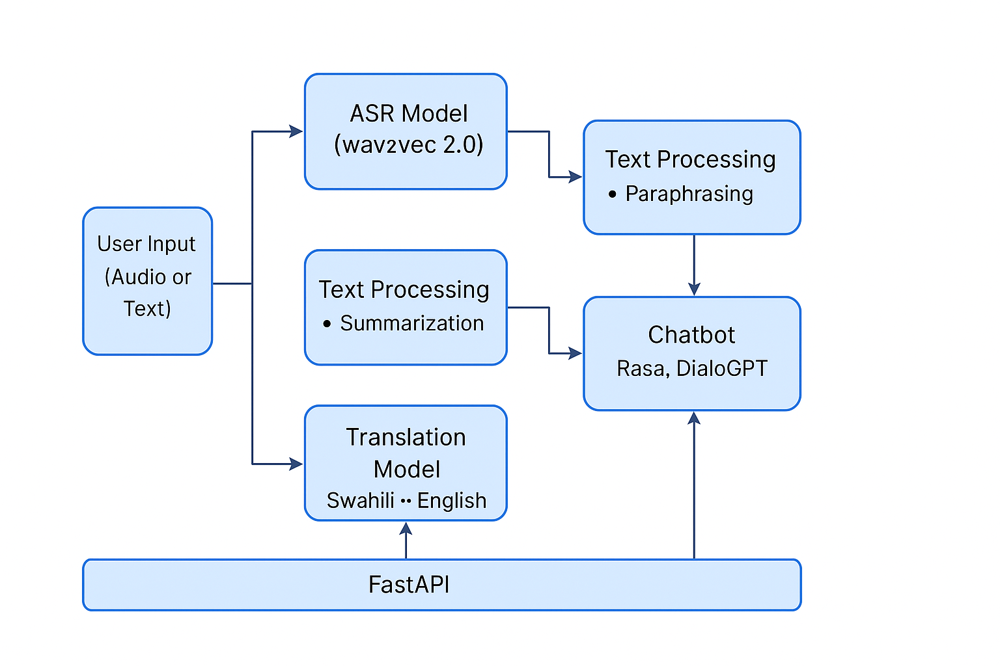

# Sema-ASR: Swahili Speech Processing Toolkit

A comprehensive toolkit for Swahili speech recognition, translation, and text processing.



## Features

- **Automatic Speech Recognition (ASR)**: Convert Swahili speech to text using fine-tuned Wav2Vec2 models
- **Machine Translation**: Translate between Swahili and English using NLLB and M2M100 models
- **Text Processing**: Paraphrase and summarize Swahili text
- **Conversational AI**: Interact with a chatbot in Swahili

## Project Structure

```
Sema-ASR/
├── data/               # Swahili text datasets
├── images/             # Project images and diagrams
├── models/             # Pre-trained and fine-tuned models
│   ├── asr/            # Speech recognition models
│   ├── text_processing/# Text processing models
│   └── translation/    # Translation models
├── notebook/           # Jupyter notebooks for experimentation
├── src/                # Source code
│   ├── asr.py          # Speech recognition module
│   ├── translation.py  # Translation module
│   ├── text_processing.py # Text processing module
│   ├── chatbot.py      # Conversational AI module
│   └── speech_translation_evaluator.py # Evaluation tools
└── translation_dicts/  # Translation dictionaries for local languages
```

## Requirements

The project requires the following main dependencies:
- PyTorch and TorchAudio for deep learning and audio processing
- Transformers for pre-trained models
- Datasets for data handling
- Librosa for audio analysis
- NLTK and Rouge for evaluation metrics
- Gradio for deployment interfaces

For a complete list of dependencies, see the `requirements.txt` file.

## Installation

```bash
# Clone the repository
git clone https://github.com/yourusername/Sema-ASR.git
cd Sema-ASR

# Create a virtual environment
python -m venv venv
source venv/bin/activate  # On Windows: venv\Scripts\activate

# Install dependencies
pip install -r requirements.txt
```

# Run App
```bash
python -m src.app
```

## Usage

### Speech Recognition

```python
from src.asr import load_wav2vec2_model, transcribe

# Load the ASR model
processor, model, device = load_wav2vec2_model()

# Transcribe audio
audio_path = "path/to/audio.wav"
transcription = transcribe(audio_path, processor, model, device)
print(transcription)
```

### Translation

```python
from src.translation import load_translation_model, translate_text

# Load the translation model
tokenizer, model = load_translation_model()

# Translate from Swahili to English
swahili_text = "Lugha ya Kiswahili ni muhimu sana kwa kuunganisha Afrika."
english_translation = translate_text(swahili_text, tokenizer, model, 
                                    src_lang="swh", tgt_lang="eng")
print(english_translation)
```

### Text Processing

```python
from src.text_processing import load_text_model, paraphrase_text, summarize_text

# Load the text processing model
tokenizer, model = load_text_model()

# Paraphrase text
text = "Swahili is one of the most spoken languages in Africa."
paraphrased = paraphrase_text(text, tokenizer, model)
print(paraphrased)

# Summarize text
summarized = summarize_text(text, tokenizer, model)
print(summarized)
```

### Chatbot

```python
from src.chatbot import load_chatbot_model, generate_response

# Load the chatbot model
tokenizer, model = load_chatbot_model()

# Generate a response
user_input = "Hello, how are you?"
response, chat_history = generate_response(user_input, tokenizer, model)
print(response)
```

## Notebooks

The project includes Jupyter notebooks for experimentation and demonstration:
- `01_introduction.ipynb`: Introduction to the project
- `02_reading_data.ipynb`: Data loading and preprocessing
- `03_machine_learning_models.ipynb`: Model training and fine-tuning
- `04_evaluation.ipynb`: Evaluation metrics and performance analysis

## Models

The project uses several pre-trained models:

- **ASR**: Fine-tuned Wav2Vec2 model for Swahili
- **Translation**: NLLB-200 and M2M100 models for Swahili-English translation
- **Text Processing**: MT5 model fine-tuned for Swahili text processing
- **Chatbot**: DialoGPT adapted for Swahili conversations

## Dataset

The project uses the Mozilla Common Voice Swahili dataset and custom Swahili text corpora for training and evaluation.

## Contributing

Contributions are welcome! Please feel free to submit a Pull Request.

1. Fork the repository
2. Create your feature branch (`git checkout -b feature/amazing-feature`)
3. Commit your changes (`git commit -m 'Add some amazing feature'`)
4. Push to the branch (`git push origin feature/amazing-feature`)
5. Open a Pull Request

## License

This project is licensed under the MIT License - see the LICENSE file for details.

## Acknowledgments

- Mozilla Common Voice for providing Swahili speech data
- Hugging Face for pre-trained models and libraries
- Contributors to the Swahili NLP community